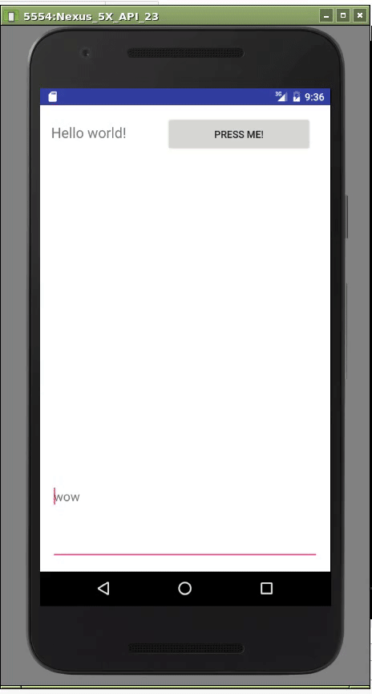

buttons and colors!
===================

## create button to change background color
- have callback function defined in xml, links back to java file
- handler must be written:

``` java
public void handleClick(View view) {
  // do stuff
}
```

- change background color of layout with `findViewById()`, `setBackgroundColor()`

## add editText, talk about layouts
- LinearLayout and RelativeLayout are most commonly used
- can modify orientation with `android:orientation`
- can use `android:layout_weight` to space elements differently
- editText holds user-modifiable text

## change background color depending upon edittext input
- read value with `getText().toString()`
- set background color as before

## Code
- code is in the folder [lol](lol/)

## Results

