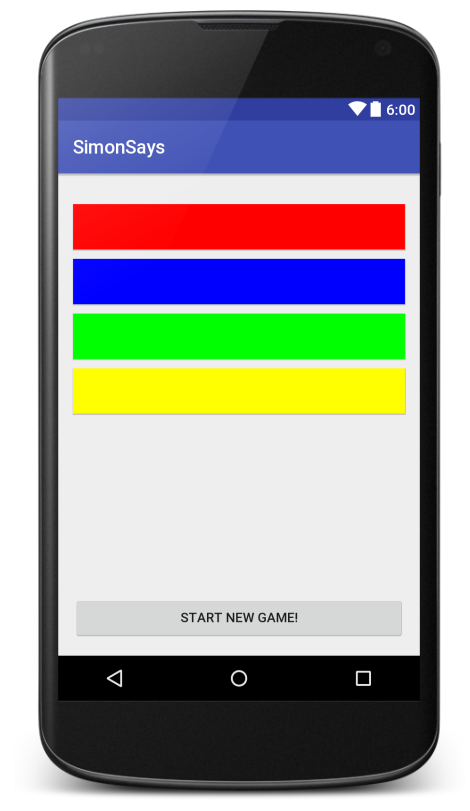

simon says
==========

## Build Your Own App
- today we're building our own app from scratch
- you can do whatever you want, or do the one we'll describe below

## Simon Says
- time-based "whack-a-mole" type game
- screen has 4 colored buttons
- at beginning of a round, a message is displayed saying which color to press
- user has a specified amount of time to press the right color
- if user presses the right color, advance to next round with less time
- if user presses wrong color or fails to do it in time, game over
- score is average time per round

## Understand UI in terms of requirements
- build a sketch of UI based on requirements
- categorize elements based on their interactions with the user
    - what does each element *do*?
    - does the user interact with the element? (**reactive**)
    - does the element change based on user data/interaction? (**dynamic**)
        - if not, can specify completely within xml (**static**)

## Example Screenshot

Just one way of doing this!

## Example Code

This is just one way of doing it! Located [here](SimonSays/).
