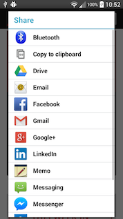

intents
=======

## documentation
- [google tutorial](https://developer.android.com/guide/components/intents-filters.html)
- [google api docs](https://developer.android.com/reference/android/content/Intent.html)
- [common intents tutorial](https://developer.android.com/guide/components/intents-common.html)

## what is an intent?
- good question
- an intent **starts some external code in android**
    - this is a form of IPC (*inter-process communication*)
    - activities
    - services
    - broadcasts
        - haven't talked about these yet

## why are intents useful?
- allow very easy inter-process communication
- this sort of thing is EXTREMELY difficult in iOS
    - there are hacks for things like music players, but generally much more difficult to rely on other apps in iOS
- same API for calling your own activities and calling external activities
    - no more difficult to make a "deep link" than it is to switch to another part of your own app

## what is an intent made of?

- [intent api reference](https://developer.android.com/reference/android/content/Intent.html)
- **action**
    - action to be performed
    - "action" verbs are strings provided by the android framework
        - e.g. `ACTION_VIEW`, `ACTION_EDIT`
- **data**
    - data to operate on
        - expressed as a uri

## types of intents
- explicit
    - provide exact activity to start
- implicit
    - uses action and data and *intent filter* to find correct activity/service to start
    - may be multiple choices that fit -- we'll discuss this

## explicit intents
- typically only used within the same app
    - need to know the exact class name of activity/service to start

``` java
Intent explicitIntent = new Intent(this, OtherActivity.class);
startActivity(explicitIntent);
```

## implicit intents
- these are the more difficult and interesting ones
- define an intent filter in android manifest with action/data
    - like other parts of android xml files, there is a special language used here
- if intent started by another activity matches the filter, the other activity is started

## implicit intent usage example
- starting an implicit intent to view an image in the Gallery app
    - we did this two weeks ago!

``` java
Uri webpageUri = Uri.parse(url); // url is a string, say "https://google.com"
Intent implicitIntent = new Intent(Intent.ACTION_VIEW, webpageUri);
startActivity(implicitIntent);
```

- example intent filter

``` xml
<activity ...>
    <intent-filter>
        <action android:name="android.intent.action.VIEW" />
        <!-- Include the host attribute if you want your terrible baby to respond
             only to URLs with your terrible baby's domain. -->
        <data android:scheme="http" android:host="www.example.com" />
        <category android:name="android.intent.category.DEFAULT" />
        <!-- The BROWSABLE category is required to get links from web pages. -->
        <category android:name="android.intent.category.BROWSABLE" />
    </intent-filter>
</activity>
```

## multiple matching filters
- what happens if multiple activities or services match the implicit intent?
- have you ever seen this dialog before?


